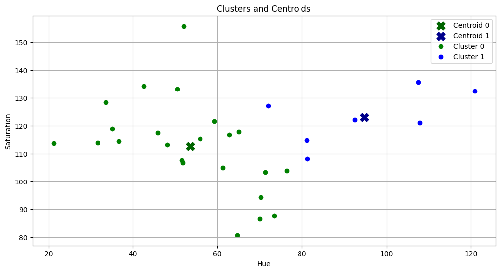
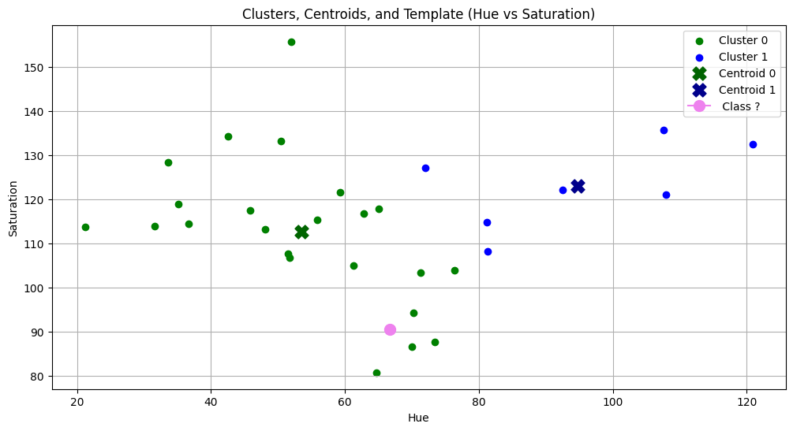
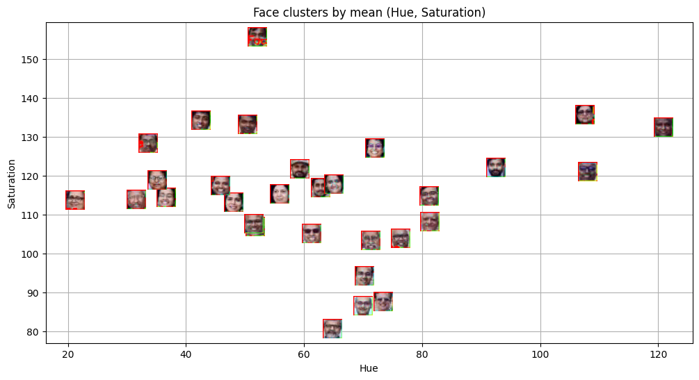
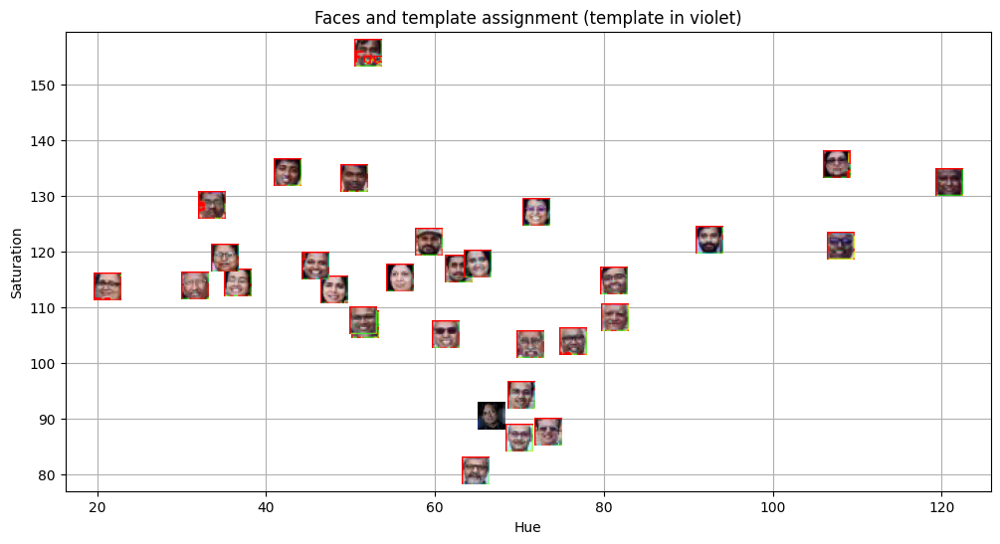

# MLPR-Lab-5
K-Means Clustering on faculty members' faces, and then addition of Shashi Tharoor's face to the mix, finally checking which cluster it falls under. 

## Aim
To implement **K-Means clustering** for recognizing and grouping similar faces from an image dataset based on **Hue and Saturation** values derived from facial regions.

## Methodology

1. **Face Detection:**
   - Used `cv2.CascadeClassifier` with Haar cascades (`haarcascade_frontalface_default.xml`) to detect faces in the input image `plaksha_Faculty.jpg`.

2. **Feature Extraction:**
   - Converted the detected face regions to **HSV** color space.
   - Extracted **Hue** and **Saturation** means for each face to represent color features.

3. **K-Means Clustering:**
   - Applied the **K-Means** algorithm (`sklearn.cluster.KMeans`) to cluster detected faces into groups based on their mean color values.
   - Used 2 clusters (`n_clusters = 2`).

4. **Visualization:**
   - Displayed bounding boxes on detected faces.
   - Plotted faces in a 2D Hue–Saturation space with distinct colors per cluster.
   - Marked centroids for both clusters.
   - Predicted cluster membership for a **template image** (`Dr_Shashi_Tharoor.jpg`).

## Results & Visualizations

### 1. Bounding Box Detection
Detected all faculty faces from the input image using OpenCV’s Haar cascade.

### 2. K-Means Clustering of Faces
Grouped the detected faces into two clusters based on their (Hue, Saturation) features.

### 3. Cluster Assignment for Template Image
Assigned the template face (`Dr_Shashi_Tharoor.jpg`) to one of the discovered clusters.

## Conclusions

- The **K-Means clustering** successfully grouped faces with similar hue–saturation profiles.
- The approach demonstrates how **unsupervised learning** can help identify patterns in visual data.
- Cross-validation and distance metrics play critical roles in enhancing the accuracy of such classification systems.

*Submitted as part of Lab 5 under the MLPR course.*
